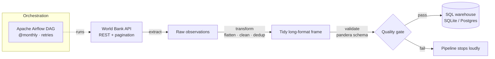

# Economic Indicators ETL Pipeline

[](https://github.com/jjmena-max/economic-indicators-etl-pipeline/actions/workflows/ci.yml)


A small but **production-style data engineering pipeline** that extracts
macro-economic indicators from the [World Bank Open Data API](https://data.worldbank.org/),
validates and reshapes them, and loads them into a SQL database — idempotently,
on a schedule, with tests and CI.

It is intentionally built the way a real ingestion job is built: modular
`extract → transform → load` stages, a data-quality contract, an orchestration
DAG, containerisation, and an automated test suite — not a single notebook.

> Default run needs **no API key and no database setup**: it writes to a local
> SQLite file. Point `DATABASE_URL` at Postgres (or anything SQLAlchemy speaks)
> when you want a real warehouse.

---

## Architecture



The same `run_pipeline()` is driven either by the standalone CLI or by the
Airflow DAG, so local runs and scheduled runs share one code path.

## Data model

The pipeline produces one tidy, analytics-ready table in **long format**:

| column           | type      | description                                   |
|------------------|-----------|-----------------------------------------------|
| `country_code`   | text      | ISO country code (e.g. `COL`)                 |
| `country_name`   | text      | Human-readable country name                   |
| `indicator_code` | text      | World Bank indicator code                     |
| `indicator_name` | text      | Human-readable indicator name                 |
| `year`           | integer   | Observation year                              |
| `value`          | real      | Indicator value                               |
| `ingested_at`    | timestamp | UTC load time (lineage)                       |

Primary key: `(country_code, indicator_code, year)` — which is also what makes
reloads **idempotent**.

## Quickstart

```bash
# 1. Install
python -m venv .venv && source .venv/bin/activate   # Windows: .venv\Scripts\activate
pip install -r requirements-dev.txt

# 2. Run the pipeline (writes economic_indicators.db, a local SQLite file)
python scripts/run_pipeline.py

# 3. ...or run + export a CSV snapshot
python scripts/run_pipeline.py --export data/sample_economic_indicators.csv

# 4. Run the tests (fully offline)
pytest
```

What gets ingested is declared in [`config/indicators.yaml`](config/indicators.yaml)
— countries, indicators and the year range. Edit it and re-run; the load step
updates changed rows in place.

## Run against Postgres with Docker

```bash
docker compose up --build
```

This starts Postgres, waits for it to be healthy, builds the pipeline image and
runs the ETL against the database.

## Orchestrate with Airflow

[`dags/economic_indicators_dag.py`](dags/economic_indicators_dag.py) defines a
`@monthly` DAG with per-stage retries (`extract → transform → load`). Drop it
into your Airflow `dags/` folder (with `src/` on the `PYTHONPATH`) and enable it.

## Project layout

```
economic-indicators-etl-pipeline/
├── src/econ_etl/        # the package: config, extract, transform, schema, load, pipeline
├── dags/                # Apache Airflow DAG
├── scripts/             # standalone CLI runner
├── config/              # indicators.yaml — declarative "what to ingest"
├── tests/               # pytest suite (offline: API faked, SQLite temp db)
├── data/                # committed sample output (real World Bank data)
├── Dockerfile / docker-compose.yml
└── .github/workflows/   # CI: ruff + pytest on 3.10 & 3.12
```

## Engineering choices worth noting

- **Idempotent loads** via delete-by-key + append inside a single transaction —
  re-running never creates duplicates and updates revised figures in place.
- **Data-quality gate**: a [pandera](https://pandera.readthedocs.io/) schema
  enforces types, ranges and uniqueness *before* anything touches the database.
- **Resilient extraction**: pagination is followed automatically and transient
  network failures are retried with exponential backoff.
- **Config over code**: the indicator/country/year scope lives in YAML, so the
  pipeline is repointed without touching Python.
- **Portable storage**: one code path runs on SQLite (zero setup) or Postgres
  (production) through SQLAlchemy.

## Tech stack

Python · pandas · SQLAlchemy · pandera · Requests · PyYAML · Apache Airflow ·
Docker · pytest · ruff · GitHub Actions

## License

MIT — see [LICENSE](LICENSE).
