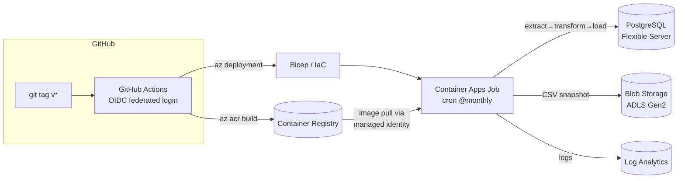

# Running this pipeline on Azure

This pipeline ships with everything needed to run as a **managed, scheduled
cloud job on Microsoft Azure** — defined as code (Bicep), deployed by CI/CD
(GitHub Actions), with no servers to maintain.



## What gets deployed

All resources live in one resource group and are described in
[`infra/main.bicep`](../infra/main.bicep):

| Resource | Purpose | SKU / tier |
|---|---|---|
| **Container Registry** | stores the ETL image | Basic |
| **Container Apps Job** | runs `extract → transform → load` on a cron schedule (the cloud equivalent of the Airflow `@monthly` DAG) | Consumption |
| **PostgreSQL Flexible Server** | the analytics warehouse the pipeline loads into | Burstable `B1ms` |
| **Storage Account (ADLS Gen2)** | Blob container holding timestamped CSV snapshots for lineage | Standard LRS |
| **Log Analytics** | centralised job logs | Pay-as-you-go |
| **User-assigned managed identity** | pulls the image from ACR and writes snapshots to Blob **without any stored secret** | — |

The job runs the same `scripts/run_pipeline.py` used locally. Two env vars are
injected by the infra so it behaves like a cloud job:

- `DATABASE_URL` — points at the Flexible Server (delivered as a Container Apps
  *secret*, TLS enforced with `sslmode=require`).
- `SNAPSHOT_ACCOUNT_URL` / `SNAPSHOT_CONTAINER` — turn on the Blob snapshot step
  (see [`src/econ_etl/snapshot.py`](../src/econ_etl/snapshot.py)). Auth is via
  `DefaultAzureCredential`, which resolves to the job's managed identity.

## Security choices worth noting

- **No long-lived cloud credentials in CI.** GitHub authenticates to Azure with
  **OIDC federated identity** — Actions exchanges a short-lived token, so there
  is no service-principal password to leak or rotate.
- **No secrets in the container.** Image pull and Blob access use a
  **managed identity** with least-privilege role assignments (`AcrPull`,
  `Storage Blob Data Contributor`). Only the DB password is a secret, scoped to
  the job.
- **Idempotent infra.** Re-running the deployment converges the resource group
  to the declared state; re-running the pipeline never duplicates rows.

## One-time setup

Prerequisites: an Azure subscription and the [Azure CLI](https://learn.microsoft.com/cli/azure/install-azure-cli).
The free account ($200 credit + 12 months of popular services free) is enough —
the Burstable Postgres and Consumption Container Apps job fit the free tiers.

```bash
az login
SUBSCRIPTION_ID=$(az account show --query id -o tsv)
TENANT_ID=$(az account show --query tenantId -o tsv)
```

### 1. Create the federated app registration for GitHub OIDC

```bash
APP_ID=$(az ad app create --display-name "econ-etl-github" --query appId -o tsv)
az ad sp create --id "$APP_ID"

# Trust this repository's tag pushes (adjust owner/repo if you forked).
az ad app federated-credential create --id "$APP_ID" --parameters '{
  "name": "github-tags",
  "issuer": "https://token.actions.githubusercontent.com",
  "subject": "repo:jjmena-max/economic-indicators-etl-pipeline:ref:refs/tags/v1.0.0",
  "audiences": ["api://AzureADTokenExchange"]
}'

# Let CI manage the resource group.
az role assignment create --assignee "$APP_ID" --role Contributor \
  --scope "/subscriptions/$SUBSCRIPTION_ID"
# (Owner or "User Access Administrator" is needed if CI must create the role
#  assignments in the Bicep template; alternatively pre-create them once.)
```

> The federated `subject` must match the workflow trigger. The example above
> trusts the tag `v1.0.0`; use `ref:refs/tags/v*` patterns per environment, or a
> branch subject (`ref:refs/heads/main`) if you deploy from `main` instead.

### 2. Add the GitHub repository secrets

In **Settings → Secrets and variables → Actions**:

| Secret | Value |
|---|---|
| `AZURE_CLIENT_ID` | `$APP_ID` from step 1 |
| `AZURE_TENANT_ID` | `$TENANT_ID` |
| `AZURE_SUBSCRIPTION_ID` | `$SUBSCRIPTION_ID` |
| `PG_ADMIN_PASSWORD` | a strong PostgreSQL admin password |

### 3. Deploy

Push a tag (or run the workflow manually from the Actions tab):

```bash
git tag v1.0.0
git push origin v1.0.0
```

The [`Deploy to Azure`](../.github/workflows/azure-deploy.yml) workflow then:

1. logs in to Azure via OIDC,
2. provisions the resource group from `infra/main.bicep`,
3. builds the image in the cloud with `az acr build` (no Docker on the runner),
4. starts the job once so you get data immediately; afterwards it runs on the
   cron schedule.

## Deploy from your laptop (no CI)

```bash
az group create -n rg-economic-indicators-etl -l eastus

az deployment group create \
  -g rg-economic-indicators-etl \
  -f infra/main.bicep -p infra/main.parameters.json \
  -p pgAdminPassword='<strong-password>' -p imageTag=local

ACR=$(az deployment group show -g rg-economic-indicators-etl -n main \
      --query properties.outputs.acrName.value -o tsv)
az acr build -r "$ACR" -t econ-etl:local .

az containerapp job start -g rg-economic-indicators-etl -n econetl-etl-job
```

## Operating it

```bash
# Tail the most recent job execution's logs
az containerapp job execution list -g rg-economic-indicators-etl -n econetl-etl-job -o table

# Trigger an ad-hoc run
az containerapp job start -g rg-economic-indicators-etl -n econetl-etl-job

# Query the warehouse
az postgres flexible-server connect -n <pg-server-name> -u etladmin -d economics
```

## Cost & teardown

With the default SKUs the steady-state cost is dominated by the Burstable
Postgres server; the Container Apps job only bills while it runs (minutes per
month) and ACR Basic + a near-empty storage account are a few cents. To remove
everything:

```bash
az group delete -n rg-economic-indicators-etl --yes --no-wait
```
